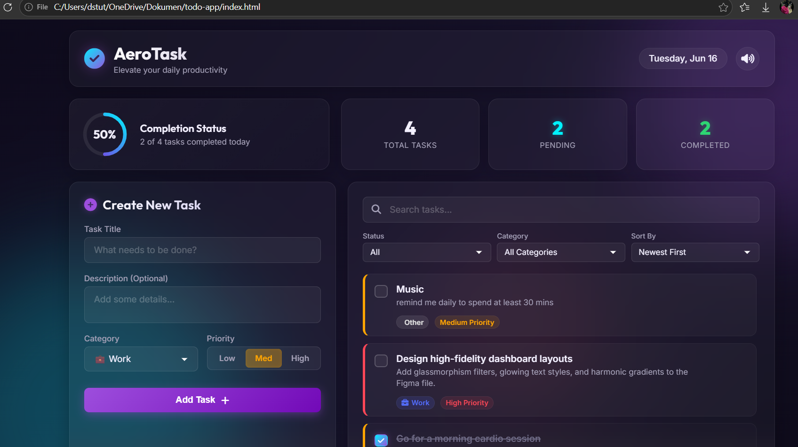

# 📝 AI-Powered Todo App

A smart Todo application built using **Antigravity 2.0** as part of the
**Google × Kaggle "5-Day AI Agents: Intensive Vibe Coding Course"**.

---

## 🚀 Features

* ✅ Add, edit, and delete tasks
* ⚡ Fast and interactive interface
* 📋 Clean and minimal UI for productivity

---

## 🛠️ Tech Stack

* HTML
* CSS
* JavaScript
* Antigravity 2.0

---

## 📚 What I Learned

* Basics of **AI Agents**
* Building apps using **Vibe Coding**
* Working with **Antigravity IDE**
* Creating real-world projects with AI concepts

---

## 🖥️ Project Setup

Follow these steps to run the project locally:

```bash
# Clone the repository
git clone https://github.com/Stuthi-Prashamshini/Agentic-Todo.git

# Navigate to the project folder
cd Agentic-Todo

# Open index.html in browser
```

---

## 🌐 Live Demo

👉 [Click here to  view the app](https://stuthi-prashamshini.github.io/Agentic-Todo/)

---

## 📸 Screenshots



---

## 🌟 Future Improvements

* Add AI-based task suggestions
* Add reminders & notifications
* Improve UI/UX

---

## 🙌 Acknowledgements

* Google & Kaggle for the learning opportunity
* AI Agents Vibe Coding Course

---

## 🔗 Connect with Me

* LinkedIn: www.linkedin.com/in/stuthi-prashamshini-d-284445334
* GitHub: https://github.com/Stuthi-Prashamshini

---

⭐ If you like this project, consider giving it a star!
